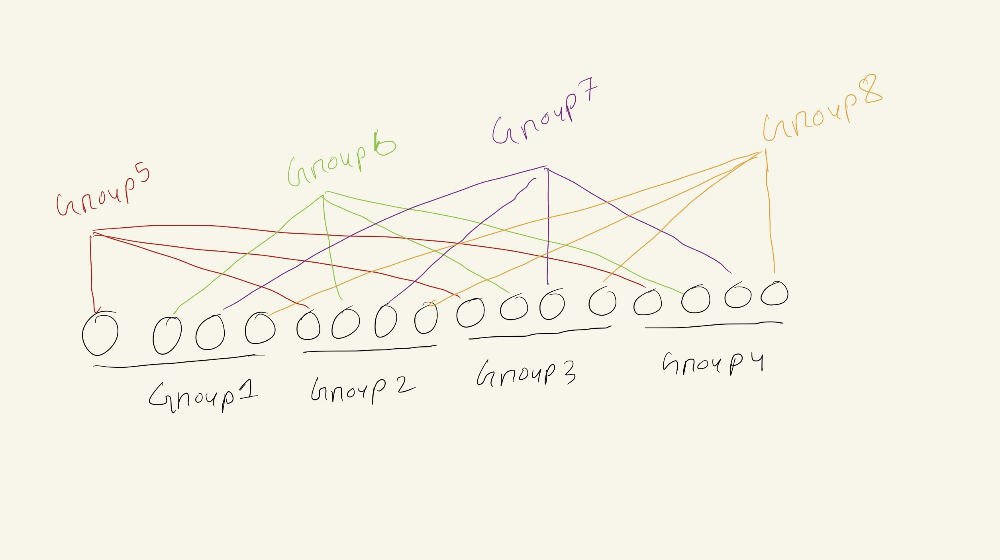

# How to run?
- Install prerequisite for maelstrom server [Link](https://github.com/jepsen-io/maelstrom/blob/main/doc/01-getting-ready/index.md)
- Download maelstrom server tar file [Link] (https://github.com/jepsen-io/maelstrom/releases/tag/v0.2.3)
- Extract tar file
- Modify ./Echo/test.sh and set correct path for maelstrom server
- Run ./Echo/test.sh

# Challenge #1: Echo
Simple echo node, reads echo request and sends echo_ok response.

# Challenge #2: UniqueIdGen
One solution can be to generate Guid.
But in my case, we already have node id as distinct number. So for each node we can create a unique id by appending a counter with the node id. For subsequent requests, we can increment the counter.

# Challenge #3a: Single node broadcast
Simple container node. For broadcast rpc, we store new messages in the node. For read rpc, we just return the stored messages.

# Challenge #3b: Multi node broadcast
Every node maintains its current message list. For every broadcast rpc, if this node is seeing this message for the first time, it will notify this message to every neighbour node. For notify rpc from peers, it will do the same as broadcast rpc.

# Challenge #3c: Fault tolerant multi node broadcast
We will develop this solution on top of Challenge #3b. Here nodes will face netwrok failure. So nodes need to reliably send the message to the neighbours. For this each node keeps track of the followin information:
- list of messages it has seen
- neighbour nodes for this node
- message counter to generate unique message id for outgoing gossip rpc
- list of pending ack gossip rpc messages
- for each neighbours it maintains a list of messages it has reliably sent to that neighbour along with the messages it has seen from that neighbour

We introduce `gossip` rpc in this solution. A gossip rpc contains list of message to send from a sender node to neighbour node. For each `gossip` received by the node, it will send `gossip_ok` response. So the sender will know whether the request reached to the neighbour or not. Now sender will resend `gossip` rpc if it desn't receive `gossip_ok` response within a timeout (100ms).

One optimization is that gossip will not include messages that are already reliable sent to the neighbour.

# Challenge #3d: Efficient Multi node broadcast part 1
There are 25 nodes, we can't use more than 30 `gossip`/`gossip_ok` operation for each broadcast/read rpc.

Also this workload introduce network delay, so each message will take 100ms to reach destination. Stable latency is calculated as time difference between the time when message was broadcasted to the cluster and the time when the message was last missing from any node after the broeadcast. We need to keep median stable latency below 400ms and max stable latency below 600ms.

Now we will batch the gossip rpc to minimize messages per opration. We will run a timer for 40ms and send new messages to other nodes via gossip rpc. We will face network delay of 100ms, so ideally we will need to wait 200ms to get `gossip_ok` response. So we will remove pending ack messages after 240ms. That means after 240ms we can retry the gossip rpc for that message. Here one optimization we introduced is that we will still keep track of timed out pending messages and allow `gossip_ok` response for those messages.

Since we are running timer for 40ms apart, we will be sending frequent gossip rpc. That will increase messages per opration. So we will not send gossip to neighbour if we already sent two gossip rpc and waiting for `gossip_ok`. Also when we send the second gossip rpc alongside an existing pending gossip rpc, we make sure that number of new messages must be at least 3/4th of the number of messages in the first gossip rpc. This way we try to minimize the number of messages per operations maintaining fault tolerance.

Now for minimizing stable latency, we will form topology by as follows.
We split 25 nodes into 5 groups of 5 nodes each. Each node will have 4 neighbours in its group. Now we form another 5 group by taking one node from each group. So each node will have 4 neighbours in other groups. In total we have 8 neighbours for each node. Groups are formed in a way that every two nodes will be within 2 hops of each other.
For better understanding a topology with 16 nodes is shown below:

Say we receaved a new broadcast message to a node. It will take 100ms to reach to all 8 neighbours, and another 100ms to reach to all other nodes. So ideally stable lateny should be 200ms.But we don't always send the `gossip` rpc as soon as a message is seen. After all of these optimization we could achive max stable latency ~500ms and median stable latency ~300ms and messages per operation ~28.

# Challenge #3e: Efficient Multi node broadcast part 2
Here we need to further optimize message per operation below 20. But median stable latency can be within 1000ms and max stable latency can be within 2000ms.

Our solution is same as previous but here we run the timer 150ms apart. So we will be sending less frequent gossip rpc.

Our solution could achive max stable latency ~600ms and median stable latency ~360ms and messages per operation ~17.

# Challenge #4: Grow-Only Counter
We will face add rpc to any node, that will increment the counter. Read rpc will return the current counter value.

This challenge comes with a go library `seq-kv` that will implement sequential key value store on the cluster. But we are solving this problem in `F#` language. So we don't have access to the provided library.

It turns out that if we generate a unique id at time time of receiving a `add` rpc, and consider this addition as a broadcast message, we can solve this problem using the solution of Challenge #3. When we get the `read` rpc, we will just accumulate the value by looking at the messages we have seen so far.